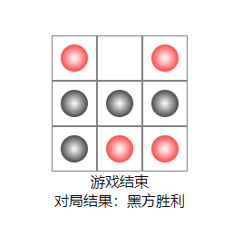
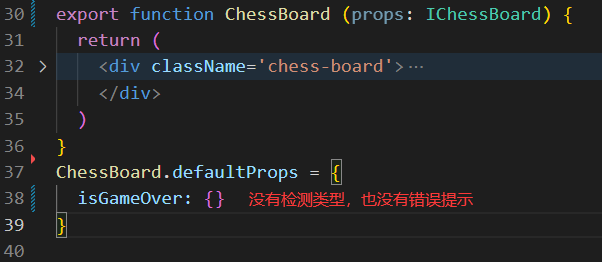
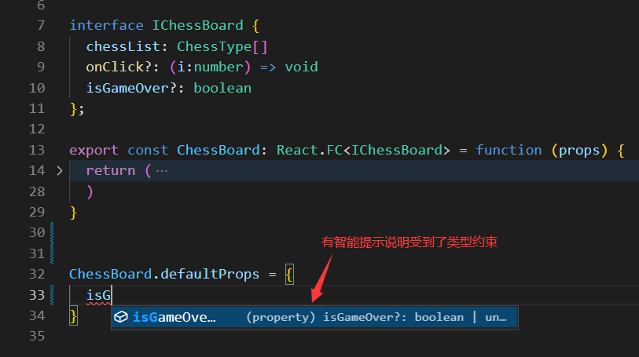

# react井字棋游戏

技术栈：react + ts + hook

## 效果展示

### 项目运行
在命令行中进入react-chess目录，然后依次执行以下命令
安装依赖：`npm install`
运行项目：`npm run start`

### 开发目的
本项目使用[create-react-app](https://create-react-app.dev/)脚手架搭建，主要学习[如何搭建react+ts项目](https://create-react-app.dev/docs/adding-typescript)，体会react+ts的开发模式，并巩固ts语法。

### 小收获
对于下面函数组件，在defaultProps中给默认属性赋值时，对defaultProps的约束并没有props保持一致。
```typescript
interface IChessBoard {
  chessList: ChessType[]
  isGameOver?: boolean // 可选属性
};
```

我们自然希望ts对props的约束能作用到defaultProps上，将函数约束成下面的这种`React.FC<>`的写法便可以做到这一点。


